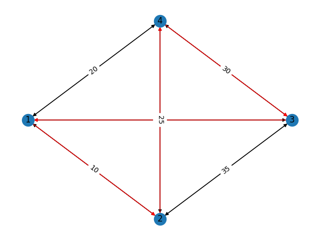

## Travelling Salesperson Problems

Approach- Dynamic Programing (Bottom up or Top down)

Feasibility- In Dynamic Programming we make decision at each step considering current problem and solution to previously solved sub problem to calculate optimal solution .

Optimally- It is guaranteed that Dynamic Programming will generate an optimal solution as it generally considers all possible cases and then choose the best.

Time complexity- Dynamic Programming is generally slower. 


### Dependency installation 
create virtual environment using conda environment yml

````bash
conda env update --file environment.yaml 
source activate TPS
````
or 

````bash
pip install -r requirements.txt 
````

### Run the program
Please enter the input graph (node and edges), and starting point in the input.json
 
 ````bash
// inside input.json

{
  "cities" : {
    "1" : [0, 10, 15, 20],
    "2" : [10, 0, 35, 25],
    "3" : [15, 35, 0, 30],
    "4" : [20, 25, 30, 0]
  },

  "start_node" : 1
}
````

To start the program
````bash
python driver_main.py
````
Runtime user operations, please enter the options to add, delete and exit from the program  

````bash
Shortest route cost value 80 and path [1, 2, 4, 3, 1]
Select the options:
 A. Add Node
 D. Delete Node
 E. Exit
 >>> A
````
##### Select option A to Add new node 
````bash
Please enter the new node number >>> 6
please enter 5 edge weights eg: 10, 20, 0 >>> 10, 20, 40, 30, 0
````
##### Select option D to Delete existing node 
````bash
Please enter the new node number >>> 4
````
##### Select option E to exit from program
````bash
 >>> E
````

## Output TPS graph


## Future possible method
- Update existing node's edge weights


## Contributors
* **Sharat Gujamagadi**

## Contact
* **Sharat Gujamagadi** (sharatcg7@gmail.com)
